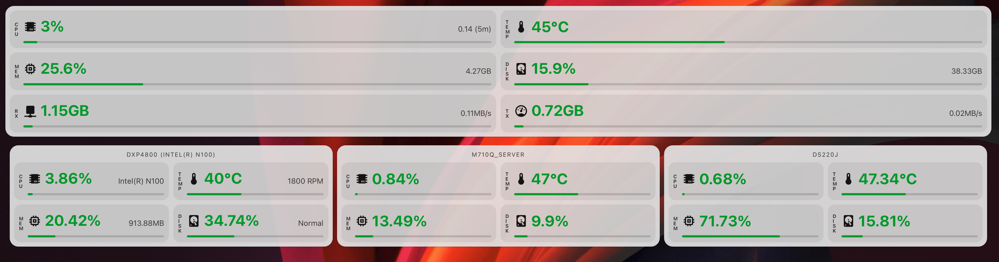

# Status Grid Card

Flexible Home Assistant custom card for status and metric tiles, with responsive layouts, profile-based thresholds, and a built-in visual editor. I felt that other available cards were too generic, so I carefully created this with GPT 5.4 Codex. It actually uses modern HA calls and features, and follows your themes properly.



## Install
You can install using HACS:

[](https://my.home-assistant.io/redirect/hacs_repository/?owner=inventor7777&repository=status-grid-card&category=plugin)

Or manually add the card as a Lovelace resource:

- URL: `/path/to/status-grid-card.js`
- Type: `module`
 
## Example YAML

```yaml
type: custom:status-grid-card
title: DXP4800
tile_count: 4
tile_columns: auto
stack_on_small_screens: true
colors:
  good: "#34c759"
  warn: "#ff9f0a"
  bad: "#ff4d4d"
tiles:
  - key: Tile_1
    name: CPU
    profile: cpu
    icon: mdi:chip
    entity: sensor.dxp4800_cpu
    unit: "%"
    sub_entity: ""
    sub_unit: ""
  - key: Tile_2
    name: Temp
    profile: temperature
    icon: mdi:thermometer
    entity: sensor.dxp4800_temperature
    unit: ""
    sub_entity: ""
    sub_unit: ""
  - key: Tile_3
    name: Memory
    profile: memory
    icon: mdi:memory
    entity: sensor.dxp4800_ram
    unit: "%"
    sub_entity: ""
    sub_unit: ""
  - key: Tile_4
    name: Disk
    profile: disk
    icon: mdi:harddisk
    entity: sensor.dxp4800_disk
    unit: "%"
    sub_entity: sensor.dxp4800_disk_free
    sub_unit: ""
```

## Notes

- In Sections view, the card now uses automatic height by not defining fixed row sizing.
- The outer card surface follows the active HA theme via `ha-card` variables like background, border radius, border, shadow, and text color.
- `tile_count` supports `2`, `4`, `6`, or `8` tiles.
- `tile_columns` controls the internal widget layout:
  - `auto` = responsive wrapping layout
  - `1` = single vertical column
  - `2` = 2 x 2 grid
  - `4` = one horizontal row
- `stack_on_small_screens` forces a single-column layout at `480px` wide and below, regardless of the selected widget layout.
- Each tile can choose a `profile` such as `cpu`, `memory`, `disk`, `temperature`, `power`, `network`, `fan`, `time`, `voltage`, `battery`, `humidity`, `energy`, `dbm`, or `custom`.
- Each tile can optionally define an `icon` using any MDI icon, and the visual editor now uses HA's native icon selector.
- `unit` overrides the main entity unit, and `sub_unit` does the same for the sub-info entity.
- `bar_max` sets the bar scale for the tile.
- `invert_thresholds` flips threshold logic so lower values become warning/critical, similar to battery behavior.
- `hide_bar` removes the bar completely for a tile.
- `colors.good`, `colors.warn`, and `colors.bad` set the shared normal, medium, and critical colors for all tiles.
- Tapping a tile opens more-info for that entity.
- Most profiles use thresholds derived from a percentage of `bar_max`.
- `battery` defaults to inverse thresholds, where lower values are worse.
- `dbm` uses absolute thresholds for signal strength: warning at `-70 dBm` and critical at `-75 dBm`, with a default bar range of `-100` to `-50`.
- Leave `unit` blank for temperature if you want Home Assistant to use the entity's own unit automatically.

Full disclaimer: This was fully vibe coded by GPT 5.4 Codex. However, I personally use this card and I am happy with it, so I decided to post in case it could help anyone else.
